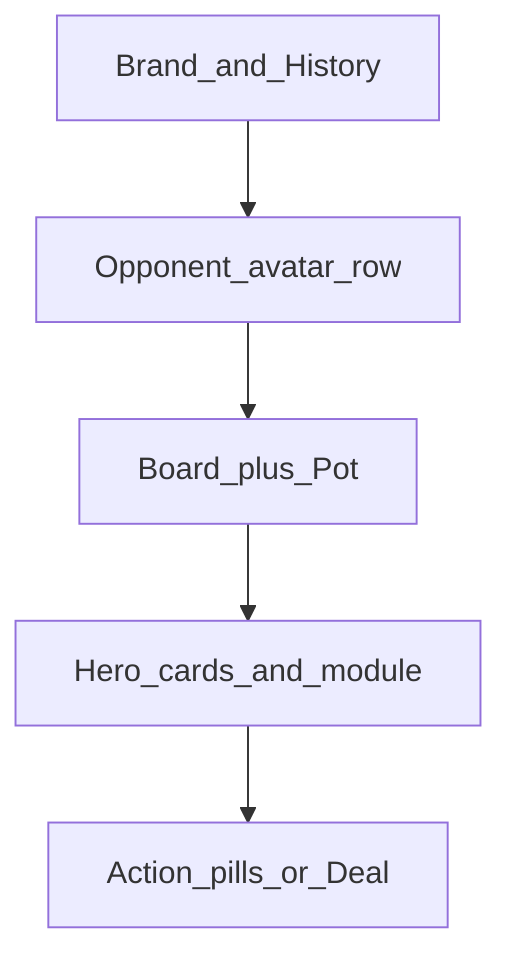

# Offsuit UI readability overhaul

Restyle the whole app to match the Offsuit blueprint in `design-system.json`, prioritizing contrast, larger cards, distinctive seat identities, and a less clunky play/stats/review layout.

## Goals

- Whole-app visual polish (play, stats, review, shell)
- Fix low-contrast text (grey on black, tiny labels)
- Slightly larger cards
- Seats/avatars that are easy to tell apart
- Less clunky / more intuitive layout
- No game-logic, engine, GTO, or stats-calculation changes

## Source of truth

Follow [`design-system.json`](design-system.json) end-to-end. Tokens already exist in [`tailwind.config.js`](tailwind.config.js) and [`src/index.css`](src/index.css) (`offsuit-pill`, `offsuit-module`, surfaces). This is a UI polish pass only.

## Contrast rules (app-wide)

Offsuit rule: white primary text on black; secondary grey (`#8E8E93`) only on a raised surface (`#1C1C1E`), never floating on pure black.

- Raise body / metadata minimum to **12–13px** (kill most `text-[9px]` / `text-[10px]`).
- Put street labels, status copy, section captions, and tips **inside** `offsuit-module` (or a surface pill), not bare on the canvas.
- Prefer solid `bg-surface` over translucent `bg-surface/60` / `bg-surface/80` so seats and chips stay legible.
- Keep success/danger for outcomes only; action controls stay neutral charcoal pills (sentence case: `Call 10`, not `CALL 10`).

Touch shared utilities in `src/index.css` / Tailwind so Stats, Review, and Feedback inherit the same readability baseline.

## Distinctive seats / avatars

Today: same grey circle + initial for everyone (`OpponentSeat.tsx`, `HeroZone.tsx`).

Add a shared `src/components/PlayerAvatar.tsx`:

- Stable color per player id/name from a small saturated palette (sky, yellow, coral, mint, lavender, peach — Offsuit-style soft accents).
- Soft gradient fill + monogram (no flat emoji faces).
- Sizes: opponent **40px**, hero **48px** (design-system `avatar.sizes`).
- Stronger active state: white ring at ~30% opacity; folded dim on the whole seat, not only text.

Use it on play seats, hand history rows, and hand review lists so opponents stay recognizable across screens.

## Cards slightly larger

In `PlayingCard.tsx` bump sizes toward Offsuit widths (sm≈44–48, md≈52–56, lg≈64–72) and slightly larger rank/suit typography.

| Context | Current | Target |
|---------|---------|--------|
| Board (`PotDisplay.tsx`) | `sm` | `md` |
| Hero hole cards (`HeroZone.tsx`) | `sm` | `md` (overlap fan kept) |
| Opponent showdown | `sm` scaled | `sm` at new larger SM |
| Empty board placeholders | 40×56 | match new board size |

Keep white faces as the brightest objects on the black table.

## Declutter play layout (`PokerTable.tsx`)

Make the table read like Offsuit: opponents → board/pot → hero → actions. Compress chrome; improve hierarchy.

- **Header:** lowercase brand (`offsuit` / trainer), one status line inside a surface chip when needed; History stays a compact pill.
- **Pot:** larger tabular amount (closer to ~22–28px hero scale); street label inside the pot pill, not freestanding grey.
- **Action log:** remove from the always-visible mid-table stack (it fights the board). Keep History sheet (`HandHistoryPanel.tsx`) as the detail surface; optional collapsed “Action log” only if needed for mid-hand review.
- **Footer actions:** keep Offsuit pill cluster (`ActionButtons.tsx` / `BetSlider.tsx`); full-width white **Deal / Next hand**; waiting state stays calm thinking dots.
- **Post-hand:** `HandResultBanner.tsx` + `FeedbackPanel.tsx` as stacked modules — white headlines, body on surfaces, badges without tiny muted text.

## Shell, Stats, Review

### AppShell (`AppShell.tsx`)

- Replace emoji tab icons with simple line SVGs (Play / Stats / Review).
- Active: white; inactive: secondary on the nav bar surface (not near-invisible muted).
- Theme toggle as a quiet icon control.

### Stats

Files: `StatsDashboard.tsx`, `HeroStatsPanel.tsx`, `GTOComparison.tsx`, `PositionalBreakdown.tsx`

- Same contrast rules; section titles at 13px medium grey on modules.
- Drop uppercase micro-labels where possible (sentence case).
- Stat bars / cards: clearer value vs GTO, fewer 10px captions.
- Keep tab structure; polish tab underline and empty states.

### Review (`HandReview.tsx`)

- Cards at the new sizes; rows as full modules; search field uses surface raised styling.

## Implementation order

1. Tokens + typography baseline (CSS / tiny Tailwind tweaks)
2. `PlayerAvatar` + wire into seats / history / review
3. Playing card size bump + board/hero usage
4. PokerTable declutter (log, pot, header hierarchy)
5. Feedback + result banners
6. AppShell nav
7. Stats + Review pass for contrast/clutter

## Checklist

- [ ] Harden typography/contrast tokens; secondary text always on surfaces
- [ ] Add `PlayerAvatar` with per-player colors; use on seats, history, review
- [ ] Bump `PlayingCard` sizes; board `md`, hero `md`
- [ ] Restructure `PokerTable`: pot hierarchy, remove mid-table action log clutter
- [ ] Polish `FeedbackPanel`, `HandResultBanner`, AppShell nav icons/contrast
- [ ] Apply same contrast/density rules across Stats tabs and HandReview

## Out of scope

- Real 3D Memoji assets / new marketing home with pastel feature cards
- Changing engine / GTO / stats calculation logic
- New product features beyond layout and visual polish
